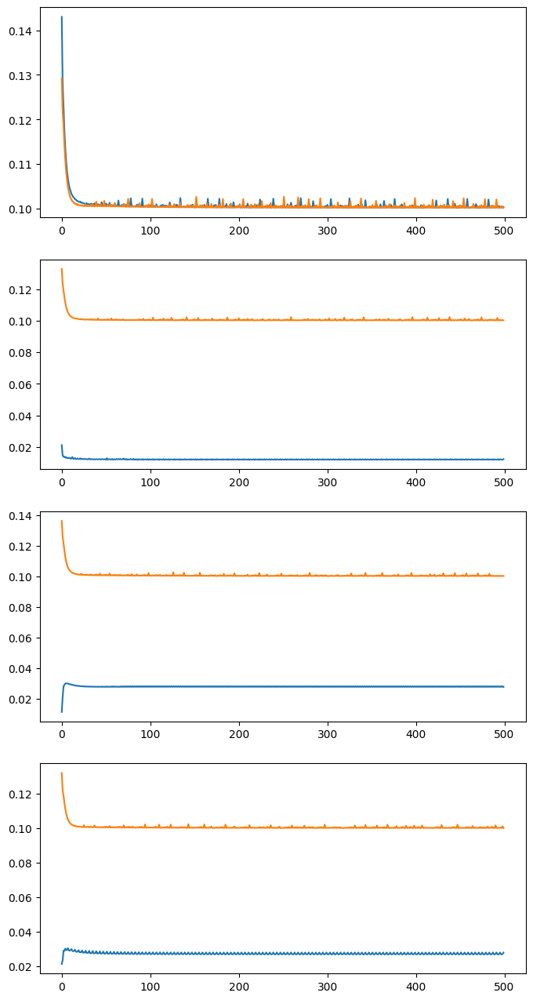

```mermaid
gantt
title 常规的Patch
dateFormat X
axisFormat %%
section 输入
X :0,336
section 输出
Y :336,432
```

```mermaid
gantt
title 按周期分段的Patch
dateFormat X
axisFormat %%
section 分段
X_seg4 :312,396
X_seg3 :208,292
X_seg2 :104,188
X_seg1 :0,84
section 输入
X = X_seg1 + X_seg2 + X_seg3 + X_seg4 :60,396
section 输出
Y :396,492
```

单变量预测对数据的预处理过程中，常规的组成 Patch 的方式忽略了时间序列的周期性，按周期分段再组合成 Patch 的方式，则考虑了周期性，先用 FFT 求出平均周期，每隔一个周期取一小段数据，组合成 Patch

### 求平均周期$\epsilon$

$\alpha=2|{\rm FFT}(D)|[: \lfloor N/2\rfloor]/N\in\R^{\lfloor N/2\rfloor}$

$\zeta=\Phi n[: \lfloor N/2\rfloor]/N\in\R^{\lfloor N/2\rfloor}$

$I_k={\rm index}({\rm top}_k(\alpha))\in\R^k$

$\alpha_k=\alpha[I_k]=2|{\rm FFT}(D)|[: \lfloor N/2\rfloor][I_k]/N\in\R^k$

$\zeta_k=\zeta[I_k]=\Phi n[: \lfloor N/2\rfloor][I_k]/N\in\R^k$

令

$\lambda_\alpha=|{\rm FFT}(D)|[: \lfloor N/2\rfloor][I_k]\in\R^k$

$\lambda_\zeta=n[: \lfloor N/2\rfloor][I_k]\in\R^k$

则有

$\alpha_k=2\lambda_\alpha/N$

$\zeta_k=\Phi\lambda_\zeta/N$

$\phi={\rm Mean}(\zeta,{\rm weights})=\dfrac{\alpha^T\zeta}{\alpha^T\alpha}=\dfrac{\Phi\lambda_\alpha^T\lambda_\zeta}{2\lambda_\alpha^T\lambda_\alpha}\in\R$

$\tau=1/\phi=\dfrac{2\lambda_\alpha^T\lambda_\alpha}{\Phi\lambda_\alpha^T\lambda_\zeta}=\dfrac{2T\lambda_\alpha^T\lambda_\alpha}{\lambda_\alpha^T\lambda_\zeta}\in\R$

$\epsilon=\lfloor\tau/T\rfloor=\left\lfloor\dfrac{2\lambda_\alpha^T\lambda_\alpha}{\lambda_\alpha^T\lambda_\zeta}\right\rfloor\in\Z$

### 分段

$T$为原始数据的采样周期，$\Phi$为采样频率，$\Phi=1/T$

段长$L$

段数$M$

$P=ML$

段定义$m(i,j)=D[i+j\epsilon:i+j\epsilon+L]\in\R^{L\times C},j\in[0,M-1]$

$X_S(i)=\underset{j=0}{\overset{M-1}{\rm Concat}}\{ m(i,j)\}\in\R^{ML\times C}=\R^{P\times C}$

最后一个段为$m(i,M-1)=D[i+(M-1)\epsilon:i+(M-1)\epsilon+L]$

$Y_S(i)=D[i+(M-1)\epsilon+L:i+(M-1)\epsilon+L+F]\in\R^{F\times C}$

$S[i]=X_S(i),Y_S(i)$

因为$Y_S(i),i+(M-1)\epsilon+L+F<L(D)$

$L(S)=L(D)-(M-1)\epsilon-L-F+1$

### 试验

以下是在ETTh1数据集预测OT列时，$M$从$1$到$4$的损失迭代图（$M=1$时，按周期分段和常规方法等价），蓝色为按周期分段方法，黄色为常规（不分段）方法

