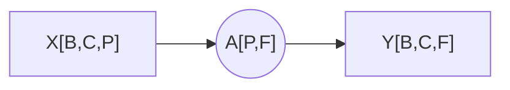
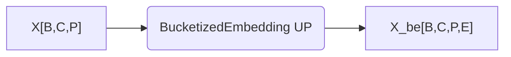
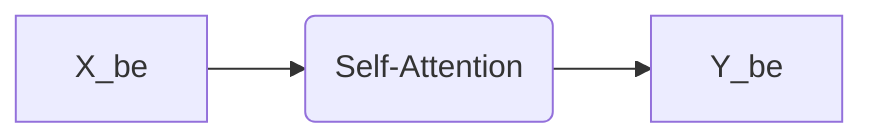
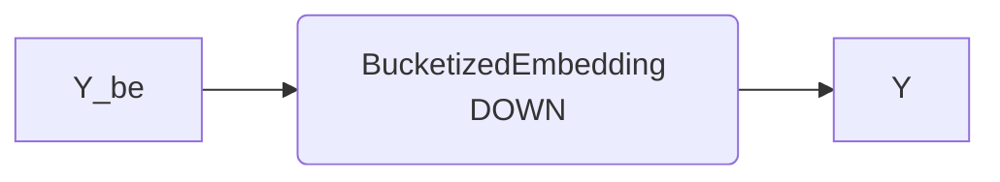
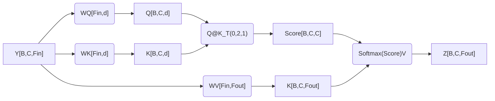

# 基本参数

$T$为取样周期

$t_0$ 为开始时间点，$t_{-1}$为结束时间点

$K$为样本总数，$t_K$为样本总时长，有$t_K=t_{-1}-t_0=KT$

$L$为段的样本长度，$t_L$为段的时间长度，$t_L=LT$

$F$为需要预测的长度，$t_F$为需要预测的时间长度，$t_F=FT$

$\tau$为主周期，$\phi$为主频率，计算有以下几种方式：

1. 取振幅最大：通过$\phi={\rm FreqWithMaxAmp}({\rm FFT}(x))$得出，有$\tau=1/\phi$

2. 有阈值取振幅最大：通过$\zeta={\rm Freq}({\rm top}_k({\rm FFT}(x)))\in \R^{k\times 1}$得到$k$个振幅最大的周期，$\theta$是筛选阈值，有$\phi={\rm FirstMoreThan}_{\theta}(\zeta)$和$\tau=1/\phi$

3. 对 topk 的频率和周期做多尺度混合？？？？？？？？？？？

4. 通过 FFT 的 topk 的频率振幅加权平均得到：

$$

\begin{align}

\alpha&={\rm Amp}({\rm top}_k({\rm FFT}(x))) \in \R^{k\times 1},k\in [1,K] \\

\zeta&={\rm Freq}({\rm top}_k({\rm FFT}(x))) \in \R^{k\times 1} \\

\phi&={\rm WeightedMean}_{\alpha}(\zeta)=\frac{\alpha\zeta^T}{\alpha\alpha^T} \\

\tau&=1/\phi

\end{align}


$$

$b$为 PF 间断点，$t_b$为 PF 间断时间点，$t_b=t_0+bT$

# 段定义

$s_0=x[t_b-t_L:t_b]$

$s_1=x[t_b-t_L-\tau:t_b-\tau]$

$s_m=x[t_b-t_L-m\tau:t_b-m\tau]$，最多$m+1$段

$s_i=x[t_b-t_L-i\tau:t_b-i\tau]$，其中$i\in[0,m]$

想要预测$F$个数据，需要涉及的过去的数据的时间长度$t_P=t_L+m\tau=PT$，过去的数据长度$P=t_P/T$

# 训练参数

$a$为过去数据的开始点，$t_a$为过去数据的开始时间点，有$t_a=t_0+aT$，为了训练时可以评估与验证，需要使得$t_a\in[t_0,t_{-1}-t_P-t_F]$，即$\Delta t_a=t_{-1}-t_0-t_F-t_P=t_K-t_F-t_P$

总行数为$N=\left\lfloor\frac{\Delta t_a}{t_P}\right\rfloor$

$n$为每批行数

$B$为批数，有$B=\left\lfloor\frac{N}{n}\right\rfloor$

设$i\in[0,B-1],j\in[0,n-1],k\in[0,m]$，则第$i$批中的第$j$个行的行号为$a=in+j$，其中的第$k段$，起始为

# 线性模型参数

$$
Y=XA+b
$$

$X$为线性模型的输入特征数，$X\in \R^{n\times(m+1)L}$，$X$的行由$s_0,s_1,\cdots,s_m$共$m+1$个段依次拼接而成，其中$s_i\in\R^{1\times L}$

$A\in\R^{(m+1)L\times F}$为权重矩阵

```python
nn.Linear(in_features=(m+1)*L, outfeatures=F)
```

# Patch Token Attention 结构

## 线性层



## Bucketize Embedding 方案



将“C 个变量 P 个过去的数据之间的相互影响”变为“C 个变量每个过去的数据之间的相互影响”（粒度变细）





## Patch Self-Attention 层

$Y\in\R^{B\times C\times F}$

每个 Channel/变量为一个 Token，故 Token 数为$C$

变量一段时间$F$内的值为 Token 分量，故向量维数或$Y$的特征数为$F$

一个“句子”矩阵$S_i=Y[i,:,:]\in\R^{C\times F}$

$d_K$是 Key 维度，$W_K\in\R^{F\times d_K}$是 Key 权重，$K=YW_K\in\R^{B\times C\times d_K}$是 Key

$d_Q=d_K$是 Query 维度，$W_Q\in\R^{F\times d_Q}$是 Query 权重，$Q=YW_Q\in\R^{B\times C\times d_Q}$是 Query

$d_V=$是 Value 维度，$W_V\in\R^{F\times d_K}$是 Value 权重，$V=YW_V\in\R^{B\times C\times d_V}$是 Value

```python
WK = nn.Linear(F,d_k)
K = WK(Y)
```

或者

```python
WK = torch.rand(size=(F,d_k))
K = Y@WK
```

$$
\begin{align}

{\rm Score}&=QK^T=Q@K.{\rm permute(0,2,1)}\in\R^{B\times C\times C} \\

{\rm Score}^*&={\rm Score}/{\sqrt \delta} \\

W&={\rm Softmax}({\rm Score*}) \\

Z&={\rm Attention}=WV

\end{align}
$$

其代码实现采用`nn.MultiheadAttention`实现

```python
attn = nn.MultiheadAttention(
    embed_dim=d_q,
    num_heads=1,
    kdim=d_k,
    vdim=d_v,
)
```

其中，`embed_dim`是指的注意力机制的输入，即$Q$，的特征维数$d_Q$，而不是自注意力的输入$Y$特征维数$F$

输出$Z$是注意力机制的输出，即修正后的 V 的值，与 Q 的尺寸一致$Z\in\R^{B\times C\times d_Q}$，$Z,W={\rm attn}(Q,K,V)$



## Patch Self-Attention 策略

### 1

$$
\begin{align*}
Y&=XA+b \\
Z&={\rm SelfAttention}(Y)
\end{align*}
$$

```python
linear = nn.Linear(P,P1)
attn = PatchSelfAttention(P1,F)
z=attn(linear(x))
```

### 2

$$
\begin{align*}
Y_1&=XA+b \\
Y_2&={\rm SelfAttention}(X)\\
Z&={\rm Mix}(Y_1,Y_2)
\end{align*}
$$

```python
linear = nn.Linear(P,F)
attn = PatchSelfAttention(P,F)
mix = nn.Linear(2*C,C)
z = mix(cat([linear(x),attn(x)],dim=1).permute(0,2,1)).permute(0,2,1)
```

# 新（以上作废）

1. get item 获取单个样本点 Sample
2. next 组成 Batch

## 传统 Dataset

```
P = seq_len = 336
F = pred_len = 96
```



```mermaid
gantt
title 数据的时间结构
dateFormat X
axisFormat %%
section 预测值
F_Y :336,432
section 真实值
S_Y :336,432
S_X :0,336
```

$X_S(i)=D[i:i+P]\in\R^{P\times C}$

$Y_S(i)=D[i+P:i+P+F]\in\R^{F\times C}$

$S$为样本集合

$S[i]=X_S(i),Y_S(i)$

因为$Y_S(i),i+P+F\lt L(D)$

所以$L(S)=L(D)-P-F+1$

## 我的 Dataset


<!-- class Obj:

    def __init__(self) -> None:
        self.P = 336
        self.M = 4
        self.F = 96
        self.L = self.P // self.M
        self.e = self.L + 20
        self.values = [0] * 17420
        self.N = len(self.values)


obj = Obj()


def get(i):
    segments = []
    for j in range(obj.M):
        seg_starts = i + j * obj.e
        seg_ends = i + j * obj.e + obj.L
        print(f"{seg_starts=},{seg_ends=}")
        segment = obj.values[seg_starts:seg_ends]
        segments.append(segment)

    # Y_S
    Y_S_starts = i + (obj.M - 1) * obj.e + obj.L
    Y_S_ends = i + (obj.M - 1) * obj.e + obj.L + obj.F
    print(f"{Y_S_starts=},{Y_S_ends=}")


get(0) -->

```mermaid
gantt
title 常规的Patch
dateFormat X
axisFormat %%
section 输入
X :0,336
section 输出
Y :336,432
```

```mermaid
gantt
title 按周期分段的Patch
dateFormat X
axisFormat %%
section 分段
X_seg4 :312,396
X_seg3 :208,292
X_seg2 :104,188
X_seg1 :0,84
section 输入
X = X_seg1 + X_seg2 + X_seg3 + X_seg4 :60,396
section 输出
Y :396,492
```





常规的组成Patch的方式，忽略了时间序列的周期性，按周期分段再组合成Patch的方式，则考虑了周期性，先用FFT求出平均周期，每隔一个周期取一小段数据，组合成Patch

### 求平均周期$\epsilon$

$\alpha=2|{\rm FFT}(D)|[: \lfloor N/2\rfloor]/N\in\R^{\lfloor N/2\rfloor}$

$\zeta=\Phi n[: \lfloor N/2\rfloor]/N\in\R^{\lfloor N/2\rfloor}$

$I_k={\rm index}({\rm top}_k(\alpha))\in\R^k$

$\alpha_k=\alpha[I_k]=2|{\rm FFT}(D)|[: \lfloor N/2\rfloor][I_k]/N\in\R^k$

$\zeta_k=\zeta[I_k]=\Phi n[: \lfloor N/2\rfloor][I_k]/N\in\R^k$

令

$\lambda_\alpha=|{\rm FFT}(D)|[: \lfloor N/2\rfloor][I_k]\in\R^k$

$\lambda_\zeta=n[: \lfloor N/2\rfloor][I_k]\in\R^k$

则有

$\alpha_k=2\lambda_\alpha/N$

$\zeta_k=\Phi\lambda_\zeta/N$

$\phi={\rm Mean}(\zeta,{\rm weights})=\dfrac{\alpha^T\zeta}{\alpha^T\alpha}=\dfrac{\Phi\lambda_\alpha^T\lambda_\zeta}{2\lambda_\alpha^T\lambda_\alpha}\in\R$

$\tau=1/\phi=\dfrac{2\lambda_\alpha^T\lambda_\alpha}{\Phi\lambda_\alpha^T\lambda_\zeta}=\dfrac{2T\lambda_\alpha^T\lambda_\alpha}{\lambda_\alpha^T\lambda_\zeta}\in\R$

$\epsilon=\lfloor\tau/T\rfloor=\left\lfloor\dfrac{2\lambda_\alpha^T\lambda_\alpha}{\lambda_\alpha^T\lambda_\zeta}\right\rfloor\in\Z$

### 分段

$T$为原始数据的采样周期，$\Phi$为采样频率，$\Phi=1/T$

段长$L$

段数$M$

$P=ML$

段定义${\rm segment}(i,j)=D[i+j\epsilon:i+j\epsilon+L]\in\R^{L\times C},j\in[0,M-1]$

$X_S(i)=\underset{j=0}{\overset{M-1}{\rm Concat}}\{{\rm segment}(i,j)\}\in\R^{ML\times C}=\R^{P\times C}$

最后一个段为$m(i,M-1)=D[i+(M-1)\epsilon:i+(M-1)\epsilon+L]$

$Y_S(i)=D[i+(M-1)\epsilon+L:i+(M-1)\epsilon+L+F]\in\R^{F\times C}$

$S[i]=X_S(i),Y_S(i)$

因为$Y_S(i),i+(M-1)\epsilon+L+F<L(D)$

$L(S)=L(D)-(M-1)\epsilon-L-F+1$

#### Linear
周期分段M=4
```
mse:0.10346032679080963, mae:0.2480061948299408
```
周期分段M=3
```
mse:0.09131679683923721, mae:0.2332393079996109
```
周期分段M=2
```
mse:0.10109332203865051, mae:0.2471691071987152
```
没有用
```
mse:0.08918645232915878, mae:0.22975368797779083
```
#### DLinear
周期分段M=4
```
0.09480347484350204, mae:0.23654554784297943
```
#### NLinear
周期分段M=4
```
mse:0.1091199666261673, mae:0.2539093494415283
```
周期分段M=3
```
mse:0.10191626101732254, mae:0.24606217443943024
```
周期分段M=2
```
mse:0.09563890099525452, mae:0.23897811770439148
```
周期分段M=1
```
mse:0.09902051836252213, mae:0.24313399195671082
```